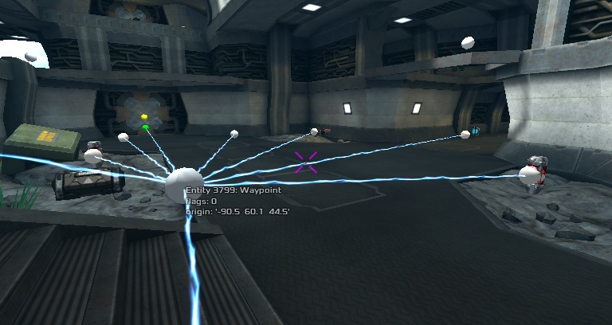
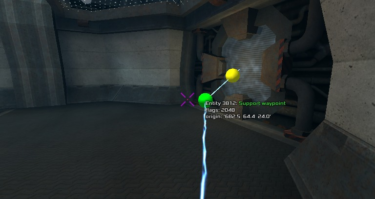
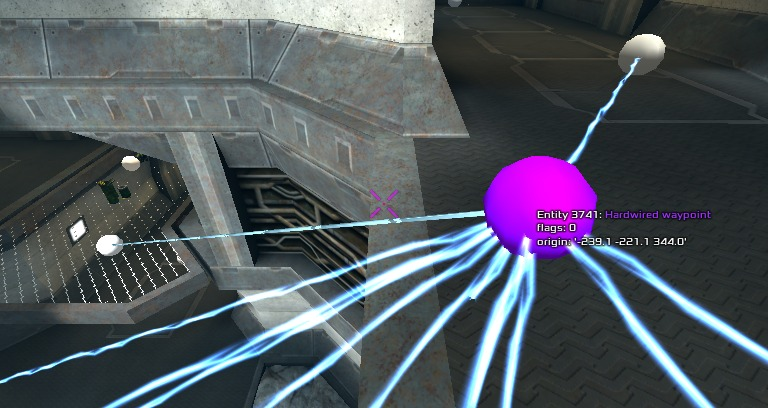
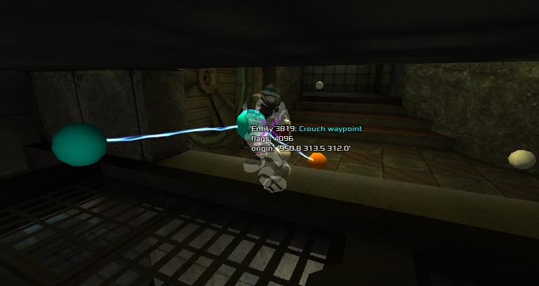
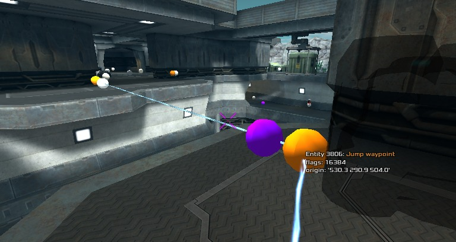
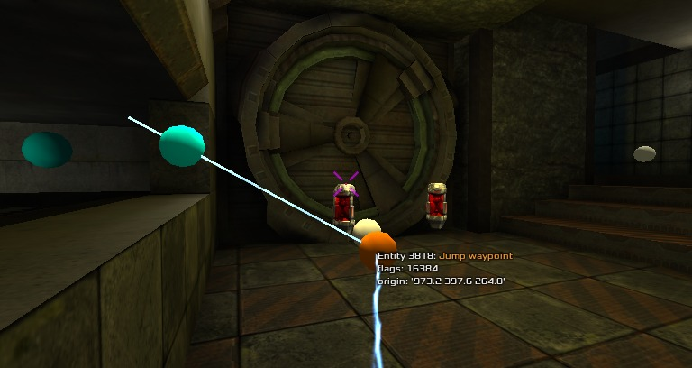

Xonotic bots require waypoints to roam about the map and find items such as CTF flags, weapons and health packs. In this guide we are gonna see how to create a good network of waypoints for them.

Note that many of the new features described here can be found **only in recent Xonotic Git builds and autobuilds**.

## Creating waypoints

#### Selecting the proper game mode

First of all you need to know what game modes are supported by the map you are going to waypoint and start the appropriated mode. To know this information you can right click on a map in the map list (menu / Singleplayer / Create window). For a map to appear in that list you need to put its .pk3 file in your ${xon_settings}/data/ directory.

* If a map supports **CTF**, you should start a CTF game since the editor automatically adds a waypoint for each flag. CTF waypoints are compatible with other modes (except Race and Assault) but keep in mind that waypoints of flags and all links from/to them will not be loaded in other modes. It's highly recommended to enable symmetrical editing on symmetrical maps as described in the [Symmetrical editing](https://gitlab.com/xonotic/xonotic/-/wikis/Creating-bot-waypoints#symmetrical-editing) section below.

* If a map supports **Assault**, you should start an Assault game and destroy all the objective but the last one before editing waypoints because otherwise there are doors / obstacles that block paths to other parts of the map. If you forget to do so, don't worry, you can make up by relinking all the waypoints with `wpeditor relinkall` after having destroyed all the objectives.

* If a map supports **Race or Race CTS and other modes** and if the map has the same layout in Race mode (some maps enable a completely different layout. e.g. Stormkeep) it's recommended to first edit and save waypoints for other modes (usually DM or CTF) so that whenever you start editing Race waypoints you can start from the existing ones. Once you save them in Race mode they become independent from the generic ones.

* If a map supports **only Race or Race CTS** you should start a Race game since the editor automatically adds waypoints for every check point. Saved waypoints are specific for this mode.

* For **all other game modes** you should start a DM game.

## Configuration

* Commands to edit waypoints:
```
wpeditor spawn               spawns a normal waypoint where you are standing
wpeditor remove              removes the nearest waypoint
wpeditor saveall             saves all waypoints and links
wpeditor relinkall           relinks all waypoints
wpeditor unreachable         determines waypoints, items and spawnpoints that can't be reached from the current position
wpeditor spawn crosshair     spawns a waypoint at crosshair's position (in general useful to create special and hardwired links with ease from existing waypoints, in particular it's the only way to create custom jumppad waypoints (spawn another waypoint to create destination))
wpeditor spawn jump          spawns a jump waypoint (spawn another waypoint to create destination)
wpeditor spawn crouch        spawns a crouch waypoint
wpeditor spawn support       spawns a support waypoint (spawn another waypoint to create destination from which all incoming links are removed), useful to replace links to problematic jumppad/teleport waypoints
wpeditor hardwire            marks the nearest waypoint as origin of a new hardwired link (spawn another waypoint over an existing one to create destination)
wpeditor hardwire crosshair  marks the waypoint at crosshair instead of the nearest waypoint
```

You can easily run all these commands and also toggle various useful settings in the waypoint editor menu (bind it to a key of your liking in the menu / Settings / Input window).

To your convenience I set up a config file with all the commands described in this guide (and more) bound to keys in an alternative bindmap so that your default keys won't be overriden. Save [th_waypointeditor_config.cfg](uploads/af2f46e366956e6ec336515564664d42/th_waypointeditor_config.cfg) into your data directory, open it in a text editor if you want to change keys then in the Xonotic console run `fs_rescan` and `exec th_waypointeditor_config.cfg`. From now on to enable keys and settings on the fly you can just exec `th_waypointeditor_enable` to enable the waypoint editor and `th_waypointeditor_disable` to disable it (instead of toggling the g_waypointeditor cvar).

#### Add / edit waypoints

* Waypoint types:

| Color | description |
| ------ | ------ |
| White  | normal waypoints                                                                                                       |
| Yellow | autogenerated waypoint (jumppads, teleporters, warpzones, ladders)                                                     |
| Red    | autogenerated waypoint for certain items that are crucial for the current game mode (e.g. CTF flags, Race checkpoints) |
| Purple | waypoint with one or more hardwired (outgoing) links                                                                   |
| Orange | Jump and Custom jumppad waypoints                                                                                      |
| Cyan   | Crouch waypoint                                                                                                        |
| Green  | Support waypoint (useful to replace incoming links of a problematic teleport / jumppad)                                |

|  Normal waypoint |  Support waypoint |
| :------: | :------: |
|   |  |
| Links to all the waypoints (except the teleporter waypoint which has a support waypoint) | Links only to the destination waypoint (the teleporter waypoint which can't have any other incoming link) |

| Hardwired waypoint | Crouch waypoint |
| :------: | :------: |
|  |  |
| Links only to the destination waypoint(s) | Links to all the waypoints within 100 qu range |

| Jump waypoint | Jump waypoint linked to a Crouch waypoint |
| :------: | :------: |
|  |  |
| Links only to the destination waypoint(s) | Links only to the destination waypoint(s) |

Enable the waypoint editor with `g_waypointeditor 1` or `th_waypointeditor_enable`, start a map and become a player to be able to edit waypoints.

If there are no user-made waypoints you can see only the autogenerated ones (yellow and red).
Start by adding normal waypoints with the command `wpeditor spawn`, the editor will then automatically generate links between them. Outgoing links are displayed as lightnings popping out from the nearest waypoint, if you want to see the incoming links you have to hold the `CROUCH` key down (default key: SHIFT).

A link from waypoint A to waypoint B means that a bot can theoretically safely walk from A to B (it can even jump obstacles but not gaps), even though in practice it depends on waypoint position and bot skill: bot may face some difficulties, for example if too close to a ledge or turning while approaching to A. In general to avoid bad surprises you shouldn't put waypoints too close to wall edges, gaps or dangerous places.

It's recommended to add waypoints near items that bots often run to such as powerups, weapons and health/armor packs. When you spawn a waypoint really close to an item it gets automatically snapped to its origin. If not desired, this behavior can be turned off on the fly by holding the `CROUCH` key down (default key: SHIFT) when you create a waypoint.

Bots can swim too if you put waypoints in the water or even above the water surface, which is preferable since players can move faster jumping over the water.

Use the command `wpeditor saveall` to save waypoints and links, preferably run this command periodically to avoid accidental loss of waypoints you have added since the last save.  
It will generate 3 files in your data directory:
* `data/data/maps/\<mapname\>.waypoints` containing waypoints data
* `data/data/maps/\<mapname\>.waypoints.cache` containing links data
* `data/data/maps/\<mapname\>.waypoints.hardwired` containing hardwired and special links data

In Race or Race CTS mode, you will get these files instead:
* `data/data/maps/\<mapname\>.race.waypoints`
* `data/data/maps/\<mapname\>.race.waypoints.cache`
* `data/data/maps/\<mapname\>.race.waypoints.hardwired`

#### Symmetrical editing:

The waypoint editor has a very useful editing mode that halves time required to waypoint symmetrical maps (mostly the CTF ones): every time you spawn / remove a waypoint, the same operation is repeated on its symmetrical position. There are even options to set up custom symmetry on maps without a perfect flag symmetry or without CTF support at all.

First of all you need to figure out the map symmetry:

1. **Point reflection**: the most common among Xonotic maps (Dance, Implosion, Geoplanetary), half part of the map is (horizontally) rotated by 180 degrees around a point (origin) that is the center of the map.
1. **Reflectional symmetry**: less common (Runningman CTF), half part of the map is a mirror-image of the other one, the axis of symmetry is in the mirror-line.
1. **Rotational symmetry** (of order 3 or greater): rarely used as it needs 3 or more flags (gasoline_3teams, gasoline_4teams). With order 3 a part of the map is rotated twice by 120 and 240 degrees around a point (origin) that is the center of the map.

If you think map symmetry is 1) or 3) try `g_waypointeditor_symmetrical 1`, if you think it's 2) try `g_waypointeditor_symmetrical 2`.
Check that the autodetermined symmetry is correct by spawning one or more test waypoint and checking that the symmetrical waypoints are spawned *exactly* where they should be. If you can't find a symmetrical waypoint or its position is wrong you can determine origin or axis of symmetry with the help of the commands `wpeditor symorigin get|set p1 p2 ... pX` and `wpeditor symaxis get|set p1 p2` where p1 p2 ... pX are positions "x y z" that you know are perfectly symmetrical. With `get` values of origin / axis are printed to the console, with `set` values of origin / axis are applied immediately, that is they are set to the g_waypointeditor_symmetrical_* cvars.  
Note: don't forget to remove test waypoints before you change symmetry settings otherwise you won't be able to easily remove their symmetrical waypoints.

The symmetry settings are saved to the waypoint files and reloaded from there when you restart the map.

```
g_waypointeditor_symmetrical is "0" ["0"] Enable symmetrical editing of waypoints on symmetrical CTF maps (Note: it assumes that the map is perfectly symmetrical). 1: automatically determine origin of symmetry; -1: use custom origin (g_waypointeditor_symmetrical_origin); 2: automatically determine axis of symmetry; -2: use custom axis (g_waypointeditor_symmetrical_axis)
g_waypointeditor_symmetrical_axis is "0 0" ["0 0"] Custom axis of symmetry (m q parameters of y = mx + q)
g_waypointeditor_symmetrical_order is "0" ["0"] if >= 2 apply rotational symmetry (around origin of symmetry) of this order, otherwise apply autodetected order of symmetry
g_waypointeditor_symmetrical_origin is "0 0" ["0 0"] Custom origin of symmetry (x y)
```

#### Advanced editing

* *Hardwired links*  
There are paths that bot can actually walk but the editor refuses to link due to small gaps or dangers. To link these kind of paths you can add a hardwired link with `wpeditor hardwire`: marks the nearest waypoint as origin of a new hardwired link (spawn another waypoint over an existing one to create destination).

* *Jump waypoint and linking*  
To create a jump waypoint you can use the command `wpeditor spawn jump` 60-80 qu before the edge depending on jump length then spawn a normal waypoint as destination waypoint on the other side of the gap. Note that jump waypoints (like jumppad waypoints) don't have any other normal outgoing link. Multiple jump links can be added to the same jump waypoint calling the command `wpeditor spawn jump` in the very same position of an existing jump waypoint and creating another normal waypoint as destination. You can recycle an existing destination waypoint as well by spawning a destination waypoint over an existing one.

* *Custom jumppad waypoint and linking*  
Not every jumppad with a perfectly vertical jump trajectory has automatically generated waypoints, if a jumppad don't have any link you can manually make it usable by bots adding a custom jumppad waypoint: aim at a jumppad and spawn a waypoint with the command `wpeditor spawn crosshair` then spawn a normal waypoint on the desired destination point. Some testing is needed to make sure bots can really use it and reach the destination waypoint.
With the same procedure it's possible to change destination waypoint of an automatically linked jumppad.

* *Spawn waypoint at crosshair*  
The command that spawns a waypoint at crosshair is very handy to add more jump links to a jump waypoint: simply aim at the jump waypoint and run `wpeditor spawn crosshair`, then aim at the desired destination waypoint and run the same command. To create a new hardwire link with ease you can use the command `wpeditor hardwire crosshair` to mark the aimed waypoint as origin, then `wpeditor spawn crosshair` to mark the aimed waypoint as destination.

* *Crouch waypoint and linking*  
To create a crouch waypoint you can use the command `wpeditor spawn crouch`. They are automatically linked to other waypoints but only if really close (less than 100 qu).

* *Support waypoint and linking*  
Some teleporters and jumppads refuse to create links from waypoints that aren't in front of them, to fix them you can create a support waypoint: spawn it very close to the problematic waypoint with the command `wpeditor spawn support`, then aim at the problematic teleporter / jumppad waypoint and run `wpeditor spawn crosshair` to create a special link and remove all the other links going to the problematic waypoint. Since the support waypoint doesn't have any other outgoing link, bots will always use it as intermediate waypoint to reach the problematic waypoint. If you used a normal waypoint instead, it would create a lot of useless outgoing links.


## Optimizing waypoints

The less links / waypoints you add, the better because in game every bot takes up quite some processing power to determine the best path for a goal.
To do so check that every waypoint is linked to as many waypoints as possible and remove redundant waypoints. Sometimes moving a waypoint a few qu (quake units) away is enough to create another link while keeping other links. For fine adjustments it's useful a key that temporarily sets slowmo to 0.1.
If you want to examine better links of a certain waypoint you can lock link view by aiming at it and running the command `wpeditor lock` (to unlock it run the same command again while aiming somewhere else).

Make sure most of the important items (weapons, health / armor packs) have a waypoint very close to them as it helps to speed up initial path search. In particular, for this optimization to work the nearest waypoint of an item should be within 50 qu from where the bot touches the item (sometimes depending on map layout an item can be reached only coming from a single direction). When possible use item waypoints as path waypoints so to keep waypoint count as low as possible.

Use the command `wpeditor unreachable` to reveal waypoints and items unreachable from your current position; it will also reveal spawnpoints without a nearest waypoint where bots would stand still after spawning. Unconnected waypoints/items will appear with a different color and a detailed report is printed to console too. To restore correct waypoint colors you can either (save waypoints and) restart the map or run `wpeditor relinkall`.


## Testing waypoints with bots

Recomended settings:
```
bot_nofire 1           // when set, bots never fire
bot_debug_goalstack 1  // visualize the current path that each bot is following
skill 4                // waypoints should work well at least with bots with medium movement skill
bot_number 1
```

Check how well bot navigates the map with your waypoints: add a single bot with medium skills and spectate it (preferably in free third person view by pressing twice `BACKSPACE` once you are spectator); if you notice it takes weird paths (zigzags), gets stuck, bumps into walls, falls down or can't jump an obstacle on some links try to fix them by creating a slightly different route that is more reliable.
It is also a good idea to test how high skilled bots behave as they can bunnyhop (skill 7 and higher).