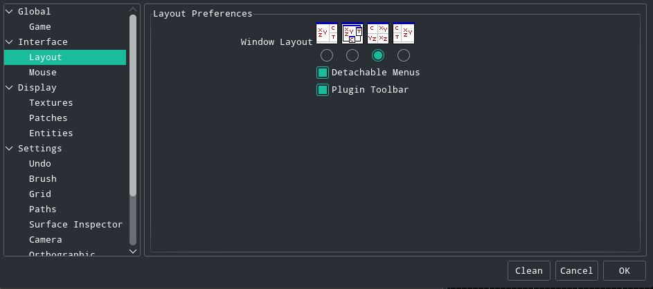
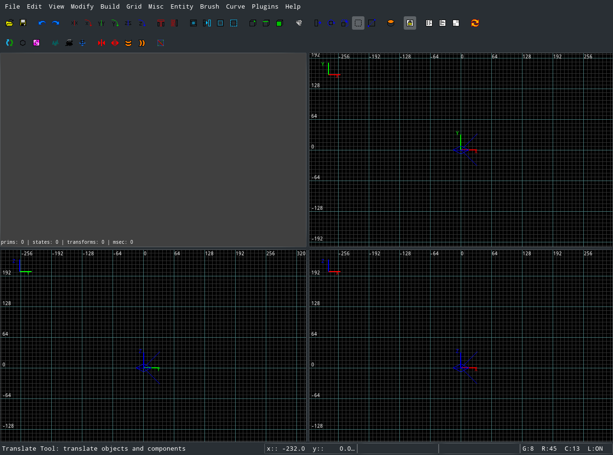

Mapping - NetRadiant
====================

Layout
------

NetRadiant offers different layouts, however the layout with three 2D panes and one 3D view is recommended.

NetRadiant will now look like this:

Note: All of the panes can be resized by dragging on their borders.

Controls
--------
### Navigational Controls

Basic controls for the 2D panes:
-   scroll wheel to zoom (shift rightclick also works)
-   hold rightclick will move around the scene
-   pressing number keys 1-9 will change the grid size (0 will hide/show the grid)

Basic controls for 3D view:
-   scroll wheel is zoom (ctrl + shift + rightclick also works)
-   rightclick toggles freecam mode
-   while in freecam mode move the mouse to look around and the mousewheel to fly around the 3d scene

### Important Keyboard shortcuts

-   `T` will toggle the Texture browser
-   `N` will toggle the Entity pane
-   `L` will toggle the Entity list
-   `S` will toggle the Surface Inspector
-   `Esc` will deselect any selected objects
-   `Shift+left mouse button` will add the object under the mouse cursor to the selection (or remove it if it's already selected)
-   `Shift+left mouse button drag` will add the objects in this box to the selection (or remove them if they're already selected)
-   `backspace` will delete all selected objects

\<\< [Setup](mapping-Setup) 2 [First Map](mapping-FirstMap) \>\>

… [Creating_Maps](Creating-Maps) …

