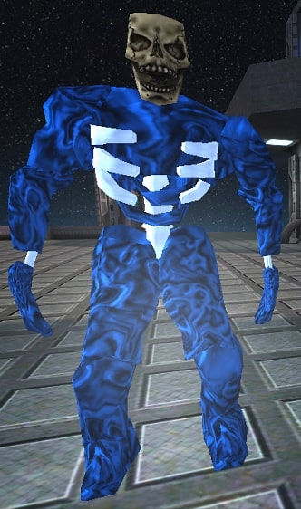
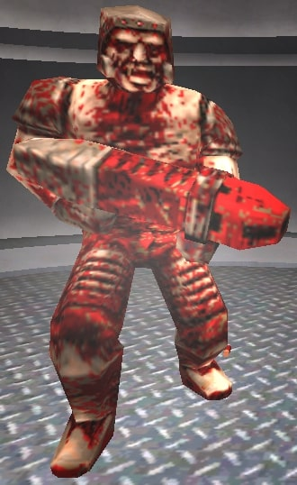

# In this info, maybe there are disabled features of the monsters. Some data is missing here.

# About

## General information

Some monsters come from the SMB modpack. Some of these aren't inside this info. Goomba and Koopa features aren't yet available in this section. Troll monster info is still unknown.
Some monsters described in this section come from Quake I. The descriptions of those monsters are taken from this wiki. You can see more description of these inside this [wiki](https://quakewiki.org/wiki/Category:Monsters).
Zombie, Spider, Wyvern, Shambler and Mage are considered part of the core.

# Official monsters

## Zombie

Zombie is an undead human that tears chunks of flesh from its head, hindquarters, and crotch before proceeding to toss them at the player character for minor damage. When someone comes close to the zombie, the zombie will start chasing and launching to attack with a bite.
When the zombie is in a dead pose in battle, can be revived and continue as before. To kill him, you will need to shoot / hit the zombie when you see it in a dead pose during the battle.

## Spider

Spider is a big arachnid that walks with 8 legs on the ground, can walk faster than other monsters.
When someone approaches the spider, the spider will spit cobweb energy balls to slow down prey and attack nearby with its chelicerae.

## Wyvern

Wyvern is a winged creature that was said to breathe fire or to possess a poisonous breath, a reptilian body, two legs or sometimes none, and a spiked tail. The alleged marine variant had a fishtail instead of the spiny dragon tail.
Wyvern flies around the map, when someone approaches this monster, the opponent will be chased and attacked by his fireballs.

## Shambler

Shamblers are truly a force to be feared. They tend to have an immense amount of health and take only half the damage from explosions. His pride and joy is his lightning energy attack.
His attacks are throwing electro balls, if the prey is near to him, he will attack with his claws.

## Mage

Mage is capable of developing magic with his powerful knowledge that he learned and practiced during his spell sciences.
Sometimes the mage can give regeneration to the owner and sometimes makes the owner pay the health for his needs to be with him. The mage attacks launching magic balls, this spell attack is called as "Mage spike".

# Unofficial monsters

## Afrit

Afrit is a dragon / flying demon that covers the flames around its body. His fire power is strong but his movements are a little slow.
Afrit can see the prey as it gets closer, when it comes, Afrit will start to follow and attack with his fireballs to the target.

## Creeper

The same things as the mage, but only attacks nearby to the prey, looks like hitting. This info is still unknown.

## Demon

Demon is a four-legged, monkey-like beast that uses its claws to slash a target. In addition, it is very fast and can leap great distances. Demons stand approximately 6 feet tall (their back rises above their head) and have a muscular appearance. With his mouth full of sharp teeth, he can gut a living being.

## Enforcer

Enforcer is an upgraded Grunt wearing a Biosuit and is equipped with a Laser Rifle.
Enforcers will fire two lasers as soon as they see you. Each laser will disappear within six seconds if it does not make contact with another entity. The lasers can be easily avoided. Due to their slow nature, it's easy to avoid the lasers and manage to attack without any difficulty.

## Ogre

Ogres carry a deadly chainsaw for melee fights and a grenade launcher otherwise (though their grenade launcher is weaker than the player's), they can truly pack a punch.

## Scrag

Scrags possess some cunning unlike other monsters. 
They are constantly moving side to side (except when attacking), and so manage to dodge many incoming slow-moving projectiles. Also, if you duck behind cover while they are attacking, they may throw an extra shot or two at your last seen location, so you might want to be careful before you pop back out again.

## Soldier

Soldier is an abandoned military warrior with grudges and a desire to kill others. His weapons aren't strong, but he can aim well at the target and control their base where he is prowling.

# More monsters that appeared in Xonotic (may not contain images from Xonotic)

## Rotfish

Rotfish are slow to medium speed minor monsters that act as a nuisance in bodies of water. Rotfishes are erroneously counted twice when assessing the monster population of a level, but only give credit for one kill, resulting in an imperfect Kill score at the level's end if they are present. 
His attacks are less threatening and usually attack with small bites.

## Rottweiler

Rottweilers are vicious dogs that use their sharp teeth to try to rip you apart. They can leap short distances to do extra damage. They can take a bite out of the target.

## Spawn

Spawn is an elastic blue blob that repeatedly flings itself at the player, doing damage with every slap. When a Spawn is killed, it lets off an explosion that deals high damage to anyone close by.

## Vore

Vore is a three-legged monster that moves very slowly, but throws spiked bombs that home in on the player's position, making them often one of the trickiest enemies to deal with, especially in combination with other enemies.
The homing firepods (more commonly known as Voreballs or Vorespikes) that are thrown by the vore can follow the player around quite sharp corners when close enough, and do not explode until they collide with something.

# Notes for players

- Spawning a monster:

*Press F8 >> Select Spawn monster >> And monster is spawned in some place of the map*

- Nades:

Nades should be enabled to summon a monster: The server has to activate `g_nades 1`

*Press F8 >> Nade type >> Continue... >> Pokenade type >> Select the monster you want to summon*

(Remember to enable the nade to summon monsters, you have to enable with this way: *Press F8 >> Nade type >> Continue... >> Pokenade*  You will change this setting with this way if you don't want to use a nade to summon monsters.)

**More info about nades are in [this link](Nades).**

- Riding with the monsters:

Only works when you threw a nade to summon a monster who follows you.
Press F to ride on top of the monster. For now, only Zombies, Spiders and Wyverns can be ridden.

# Notes for developers

**Official monsters source codes are in this [directory](https://gitlab.com/xonotic/xonotic-data.pk3dir/-/tree/master/qcsrc/common/monsters).**
There are unofficial monsters source codes stored in the [SMB modpack](https://github.com/MarioSMB/modpack/tree/master/mod/common/monsters).