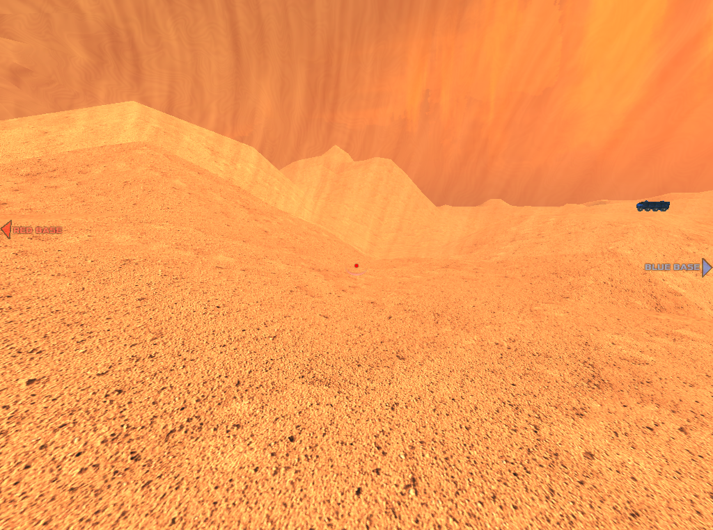

# Nades

Come in a variety of types. The offhand hook bind or drop weapon bind throws the grenade. Hold the throw key E to cook the nade. (*NOTE: If you have a Grappling Hook weapon with you, you will have to press the G key once to throw it and then press it again when you want to throw the nade. Due to development reasons, the Grappling Hook only can be used with the E key as the main key, so it was developed to avoid errors in the game.*) Press F8 to switch nade types.

# Nade types

## Normal

Frag grenade. Explodes.

## Napalm

Shoots several napalm globs in a circle around the nade. Touching these will ignite players and likely kill them.

## Nitro

Freezes enemies in a large radius. Lethal.

## Translocate 

Teleports the player to where the nade "explodes".

## Spawn

Creates a spawn point that can be respawned on three times. It's useful when you need to go back in the point where you want to start after died, instead starting in the main points.

## Healing

Regenerates health in a large radius around the nade.

## Entrap

Slows movement within a large radius for 12 seconds. Makes the balls' gravity fall faster when they are inside the orb. In the orb, you will see that the electro balls fall quicker inside and rockets / bullets are slowing down.

## Veil

It creates an orb which makes invisible to the players during a time.

# Pokenade 

Spawns a monster. Four monsters can be alive at one time. Options include:

## Zombie

Medium speed melee attacker. Can be ridden for movement speed higher than running (but not as fast as strafe jumping).

## Spider

High speed melee attacker. Drops 25 health on death.

## Wyvern

Flying monster.

## Shambler

Large, slow melee attacker. Drops 100 health on death.

## Random

Spawns all of the above and a marine at random.

**More info about monsters are in [this link](Monsters).**

## Notes for players and developers

If you are creating a server for yourself, to play with the nades, you need to activate the nades and it is recommended to set those variables:

`g_nades 1 // activate nades in the game`

`set g_nades_nade_damage 150 // normal nade explosion damage`

`set g_nades_bonus 1 // adding number of extra nades when it's obtained after time bonus`

`set g_nades_bonus_client_select 1`

`set g_nades_bonus_type 3 // limit of number of nades when a player had`

`set g_nades_bonus_score_time 5 // time when someone is scoring, makes adding fast one nade extra more`

`set g_nades_heal_foe -5 // when someone is not ally of the healing orb will take damage during a certain time if this is inside the orb`

`set g_nades_napalm_ball_damage 110 // napalm explosion damage`

`set g_nades_napalm_ball_lifetime 4 // napalm burning time after exploded`

`set g_nades_napalm_burntime 3 // napalm burn time when someone is burning with those flames`

`set g_nades_entrap_time 15 // entrap orb time`

`set g_nades_nade_refire 10`

`set g_nades_spawn_count 1`

`set g_nades_veil_radius 720 // veil orb radius size`

`set g_nades_veil_time 6 // veil orb time`

`set g_nades_ice_freeze_time 2 // How long the ice field will last`

`set g_nades_ice_health      1 // How much health the player will have after being unfrozen`

`set g_nades_ice_teamcheck   0 // Don't freeze teammates`

`set g_nades_ice_explode     1 // Whether the ice nade should explode again once the ice field dissipated`

After setting all this, it can be necessary to restart the server, use `restart` command to apply the changes. Instead doing this manually, you can put those variables in a *.cfg* file. Save the variables inside *nades.cfg* empty file and save it in *xonotic/data* folder. In the game, when you are playing in your own server, execute in the console: `exec nades.cfg` and restart if it's necessary.