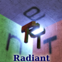

NetRadiant - A Stabilized Q3 Map Editor
=======================================

-   [NetRadiant](NetRadiant)
-   [Download NetRadiant](Download NetRadiant)
-   [Additional map editor features](Additional map editor features)
-   [Additional map compiler features](Additional map compiler features)
-   [Complete list of entity keys](Complete-list-of-entity-keys)
-   [Complete list of command line parameters](Complete-list-of-command-line-parameters)
-   [Complete list of shader keywords](Complete-list-of-shader-keywords)

NetRadiant is a fork of the well-known map editor for Q3 based games, [GtkRadiant 1.5](https://github.com/TTimo/GtkRadiant/tree/1.5) ([Homepage](https://icculus.org/gtkradiant/)).
The focus is put on stabilizing and bugfixing the included map compiler, q3map2, so it can become a reliable tool for map authors.

Fixes include:
-   Better decompiling by q3map2 (texcoords no longer get lost)
-   Fixed 3D display in the Windows XP Software Renderer
-   Fixed deluxemapping when a surface is lit from both sides
-   Fixed some buffer overruns
-   Fixed the “expand selection to whole entities” feature
-   Fixed the origin of mirrored eclassmodel entities
-   Key bindings no longer disappear when using an international keyboard layout
-   Plane snapping fixed (no more fall-through holes in imported model terrain)
-   Various other map compiler fixes

Games supported by included game packs:
-   [DarkPlaces](http://icculus.org/twilight/darkplaces/)
-   [Nexuiz](http://www.nexuiz.com/)
-   [Quake2World](http://www.quake2world.net/)
-   [Warsow](http://www.warsow.net/)

For licensing reasons, no other game packs are included yet. Other games can very well be added into the default distribution, if their license is GPL compatible. However, for these games there are downloadable game packs that are likely to work inside NetRadiant (the links go to download locations for the packs):

-   [OpenArena](http://openarena.ws/board/index.php?topic=2722.0)
-   [Q3Rally](http://www.q3rally.com/index.php?module=Downloads&func=display&lid=57)
-   [THC](https://svn.freepository.com/99tOHY5flO0Uk-web/browser/NetRadiant?rev=730)
-   [Tremulous](http://ingar.satgnu.net/gtkradiant/index.html)

These packs are inclusion candidates if someone cleans them up of non-GPL content. Also, a GPL compatible Q3A pack would be highly appreciated.

Note that ZeroRadiant game packs will *not* work.

