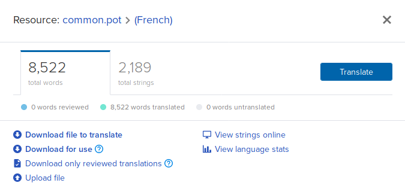

It is possible to download translation files from Transifex so you can work with an external editor or test your translations in-game.

On Transifex, select the **common.pot** resource:

*  Select **"Download for use"** if you wish to test the translation in-game.
*  Select **"Download file to translate"** if you wish to edit the PO file with an external tool (such as [poedit](https://poedit.net/))
*  Select **"Upload file"** if you wish to upload a PO file that you edited on your computer.

In order to test your translation in-game, rename the PO file as **common.*.po**, where * is your language code ("fr" for French, "de" for German...).
If you don't know what your language code is, please have a look at the PO files in the [xonotic-data.pk3dir](https://gitlab.com/xonotic/xonotic-data.pk3dir) repository.

Then copy the PO file in your Xonotic user directory, in the **data** subdirectory.
The user directory location depends on your Operating System: https://xonotic.org/faq/#where-are-the-configuration-files-located

You're done!
Simply start Xonotic and test your latest translation changes.