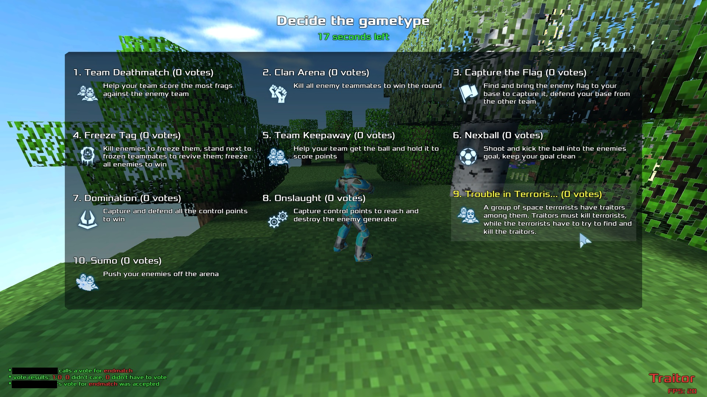
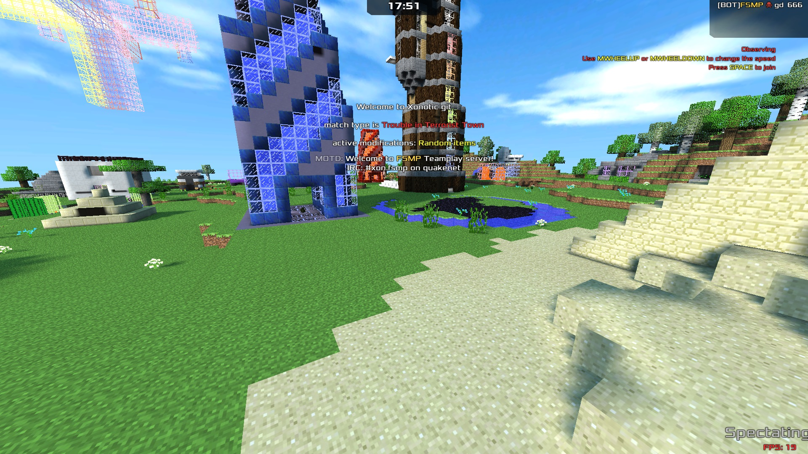
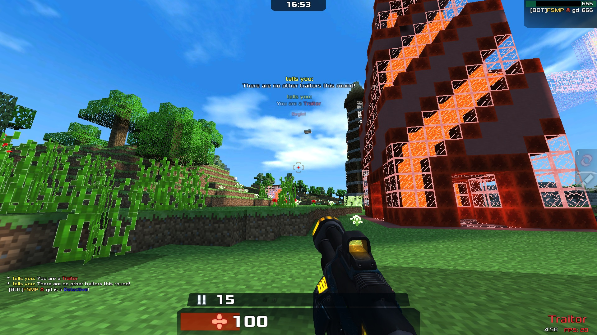
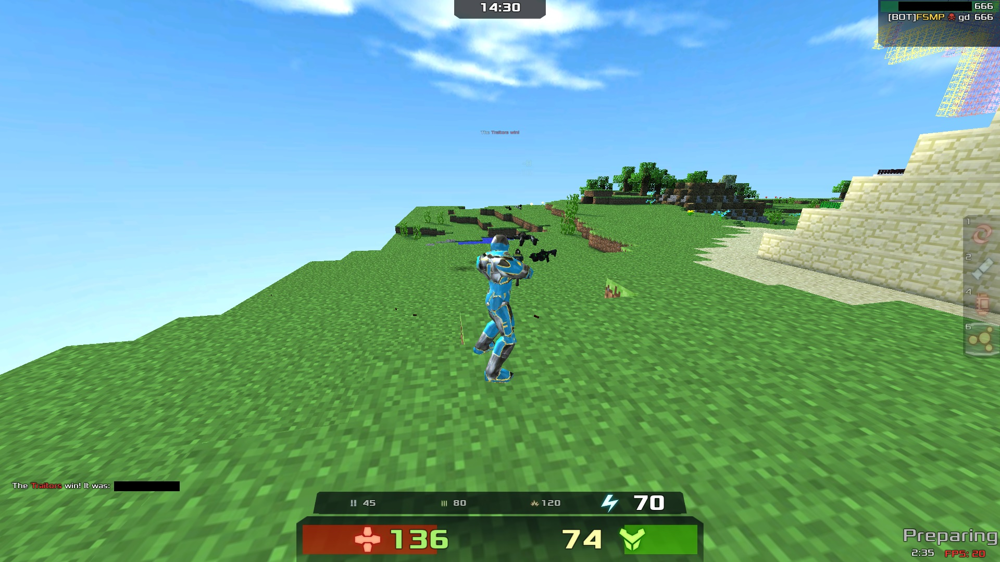

# Trouble in Terrorist Town (TTT)

## WARNING! This gamemode has been lost. There is no way to recover this only if the responsible author does. Possibly the author didn't share and it's hard to find him to recover this. The community would be glad to retrieve these gamemode resources.

## This gamemode appeared once in a server called "FSMP Teamplay", the server was shutdown in late 2019.

A group of space terrorists have traitors among them. Traitors must kill terrorists, while the terrorists have to try to find and kill the traitors.

# Objective of the Game

The game mode is based on the fact that there is a small group of traitors and another of detectives, there is an explanation of the functions of each one.

## Innocents

The Innocent are the majority (62.5% of the game's population by default.) Their group color is green.
The task of the innocent is to detect traitors and defend detectives more than anything, they must kill the right person or anything special.

## Traitors

The Traitors are the medium sized group in TTT (25% of the population or one Traitor for every four players.) Their group color is red, but this is not displayed to anyone other than Traitors, or when a Traitor has been confirmed to be dead.
The traitors must murder everyone undetected, they know who they are because only among themselves do they see a red "circle" that blinks around their companions' bodies. They must kill all innocents before time runs out.

## Detectives

The Detectives are the smallest group in TTT (12.5% of the population or one Detective for every eight players.) They are special Innocents given equipment. Their group color is blue.
Detectives have special methods to detect the traitor, for example, when they see a body, they must analyze the body, searching in it until it says a message in the middle "Unidentified", when seeing it, touch the E, if the body was recently killed, it will tell if he was Innocent or a Traitor.

They always appear as CT and everyone sees them as CTs, plus they flash a blue circle on their body that everyone sees (unlike traitors who only see each other CT and the flash is only seen by them).

## About Karma points

It is worth clarifying that everyone can kill each other, but there is something called "**Karma**", which starts with an initial, and increases if they do things right (if traitors kill, or if traitors kill people), otherwise, the Karma will be discounted.

The Karma is used for the damage that weapons generate, the more Karma, the more damage your weapon will do.

If the Karma is lower, the player can be banned temporarily to avoid teamkills or any abuse with the end to keep the game in balance.

# Screenshots and demos

The screenshots are from 23/08/2019.

**Demos here, thanks to Kotangens, he has given his best effort to record this**:

To play the demo, you need the following resources:

- Models and server resources (copy and paste them to data/dlcache):

[fsmp-teamplay-hats-1.1.0.pk3](uploads/40d56cf47c83b50e18b4d5e56eece21a/fsmp-teamplay-hats-1.1.0.pk3)

[fsmp-teamplay-hats-1.2.0.pk3](uploads/9997b9cb9e9f3405a3e374811caa37ec/fsmp-teamplay-hats-1.2.0.pk3)

[fsmp-teamplay-server-files-1.3.0.pk3](uploads/b72f913d9a32520275a943b6c3fde511/fsmp-teamplay-server-files-1.3.0.pk3)

[fsmp-teamplay-server-files-1.4.0.pk3](uploads/ba94aa50b9d2a1b4afbbe277ce4e8e3e/fsmp-teamplay-server-files-1.4.0.pk3)

[csprogs-xonotic-v0.8.2-2564-g68e9345d4.pk3](uploads/0fcb08f67791913d31dbaa89f6f4abf7/csprogs-xonotic-v0.8.2-2564-g68e9345d4.pk3)

- Minecraft map for demo (compressed as .zip, it needs to uncompress and copy .pk3 file and paste to data/dlcache):

[minectf_fsmp1.zip](uploads/3b589d72556bff2e9426025e5550c2ea/minectf_fsmp1.zip)

- Demo files (copy and paste to data):

Best recorded demo:

[2019-10-02_21-54_minectf.dem](uploads/8ba3d79131713563e8d2ba35aa7d1b55/2019-10-02_21-54_minectf.dem)

Demo without players, only bots:

[2019.07.11-9_08_minectf__ttt__show_result_.dem](uploads/10a03f55b5aed6a2fcfe68a8d8b7023f/2019.07.11-9_08_minectf__ttt__show_result_.dem)

After adding these resources, type in the game console: 

I recommended you watch the **best recorded demo**:

`playdemo "2019-10-02_21-54_minectf.dem"`

Other demo:

`playdemo "2019.07.11-9_08(minectf)(ttt)(show result).dem"`

# Rules

## Basic Rules

All basic rules apply to any role and or players.
​

- No Randomly Damaging Mate​

1. Randomly Damaging a teammate without sufficient evidence of them committing a kill on site as offence, This includes damages that have been done unintentionally.​

2. Killing any player that is away from their keyboard.​

- No Traitor Baiting

1. Performing traitorous acts as Innocent repeatedly.

2. Tricking other players into believing you're a Traitor.

## Role Rules

These rules only apply if you are apart of that role for example you can't break a detective rule if you're an innocent.​

**Innocents**​

1. Do not commit any Traitorous acts.

2. Do not work with Traitors

3. Only kill when you have a valid reason to do so.

4. Obey valid detective orders at all times.

5. Do not harm the detectives in any way.

6. Do not use a Traitor defib at all.

**Traitors**

1. Do not kill other Traitors.

2. Always try to alert other Traitors to your traps.

3. Do not sell out other Traitors.

4. Do not use a Cleaning defib at all.

**Detectives**

1. Do not give unreasonable orders.

2. Do not harm Innocents

3. Do not abuse your powers.

4. Do not work with Traitors.

5. Do not use the Traitor defib at All.

## Kill on Site Rules

A kill on site must come under valid for you to act on it. Any kill on site marked with the role letter and color (D, T or I) are only valid if given by that role. if you kill on site someone for an invalid reason then you may be warned for False kill on site.​

- Valid kill on site​

1. Self Defence.

2. Damage without a valid reason.​

3. Mass killing.​

4. Associating with Traitors.​

5. Hiding game sensitive items.​

6. Using traitor weaponry without being proven.​

7. Failing to Identify bodies after killing.​

8. Walking past multiple unidentified bodies.​

9. Not following Detectives orders. (D)​

- Invalid kill on site​

1. Kill on site on a Skin.​

2. Kill on site on a Weapon.​

3. Kill on site on a Location.​

4. Not following Innocents orders.​

5. Suspicion.​

6. Aiming at players.​

## Notes for developers / mappers

Sorry, developers, the code will have to be recreated, it is hard to find it in order to recover it.

Inside the map (.pk3 file), in .mapinfo file, you write: `gametype ttt`

Optionally, you can write this too:

`settemp_for_type ttt g_buffs 0`

`settemp_for_type ttt g_new_toys 1`

`settemp_for_type ttt g_random_items 1`

`settemp_for_type ttt g_random_items_powerup_probability 0`

`settemp_for_type ttt g_random_items_weapon_crylink_probability 0`

`settemp_for_type ttt g_random_items_weapon_devastator_probability 0`

`settemp_for_type ttt g_random_items_weapon_electro_probability 0`

`settemp_for_type ttt g_random_items_weapon_hlac_probability 1`

`settemp_for_type ttt g_random_items_weapon_minelayer_probability 1`

`settemp_for_type ttt g_random_items_weapon_vortex_probability 0`

`settemp_for_type ttt g_random_items_weapon_rifle_probability 1`

`settemp_for_type ttt g_random_items_item_armor_mega_probability 0`

`settemp_for_type ttt g_random_items_item_health_mega_probability 0`

`settemp_for_type ttt g_pickup_respawntime_ammo 0`

`settemp_for_type ttt g_pickup_respawntime_weapon 0`

`settemp_for_type ttt g_chat_nospectators 2`

Moreover, you can enable this gamemode in the console using this command: 
`sv_cmd gametype ttt`
