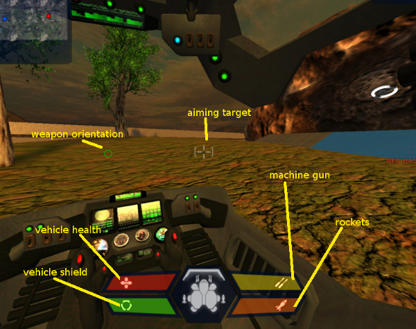
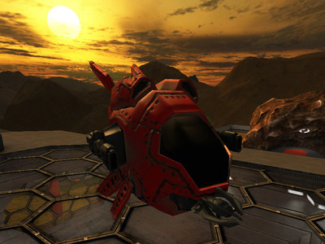
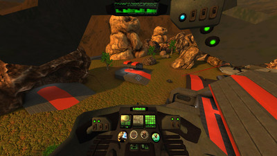
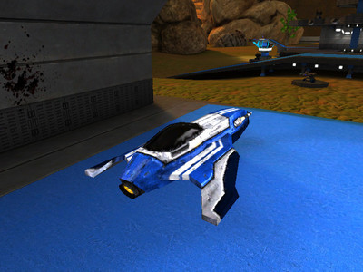
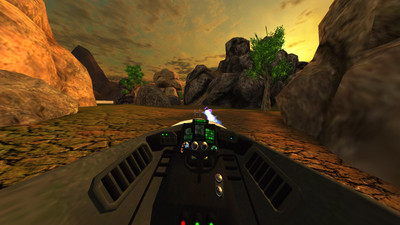
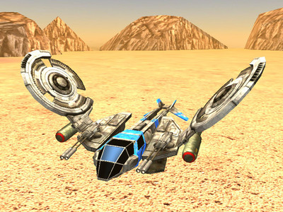
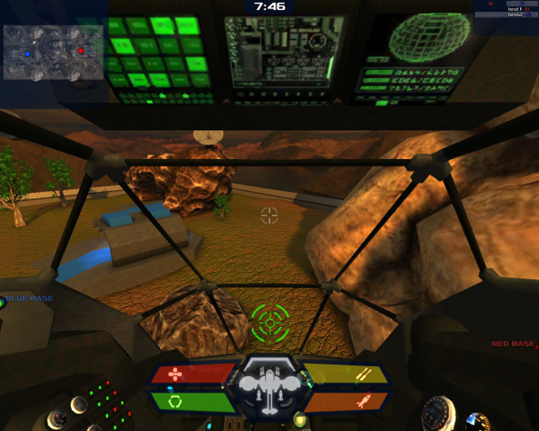
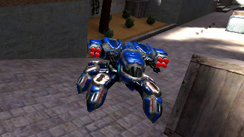
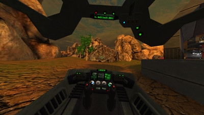

Vehicles
========
# About

## General informatoin

Vehicles in Xonotic introduce new dynamics and fun in team play, especially Capture The Flag (CTF), compared to traditional vehicle-free games.

There are several types of vehicles in Xonotic. Some can fly, some can jump, some can walk, and some can dive. Some need at least one player to operate (drive or pilot). Some vehicles need, in addition to the driver/pilot, one or more gunners to operate the weapons on the vehicles. Some vehicles are not equipped with weapons but can transport a lot of players to a differnt location.

## Play a game with vehicles

Vehicles are available in maps that support them, i.e. maps that have vehicle placed in them. The map makers, or the mappers, have to put vehicles in maps for players to play.

Any standard servers support vehicles if they include maps with veheciles placed in them. [Some servers](Special_Servers) features only large maps for vehicles.

[Unsealed Trial 3](http://dl.xonotic.co/unsealedtrial3-full-51eac9fbb6b2b8f3037ff242ef62a6f3698526f6-aff677d276411b4391becf801121abc211c7dcaa.pk3) is a map that supports all offical vehicles.

# Operating a vehicle

## Basic control

To enter a vehicle, simple go/jump into it. To leave a vehicle, use the keybind "+use" (default key: "F").

The first player to enter the vehicle will be the driver/pilot. The movement for differnt vehicles are slightly different, but in general +forward (W), +backward (S), +moveleft (A), +moveright (D), +crouch (SHIFT), +jump (SPACE), and mouse movement are used for controlling vehicle movement. +fire (mouse left click) and +fire2 (mouse right click) triggers the primary and secondary weapon, respectively.

If the vehicle supports multi-passengers, then after the driver/pilot enter the vehicles, subsequent players who enter the vehicle will be the passengers. Some vehicles have weapons for passengers. The same keys above are likely to control the weapon aims as well.

## Cockpit view

Different vehicles have different cockpit view; however, the general principles are the same. Shown above is Spiderbot's cockpit.

### Status Panel

Status panel is at the bottom; it shows, clockwise from lower-left, vehicle shield level, vehicle health, primary weapon status, and secondary weapon staus. In the center of this panel is the general status report of the vehicle.

The vehicle shield protects the vehicle from attack and collision, which, when happens, lowers the shield level. The shield level will gradually restore over time. When the level drops to zero, the vehicle will start taking damages.

The vehicle health is affected when there is no shield protecting the vehicle. When it drops to zero, the vehicle explodes. Some vehicles can slowly repairs itself.

The primary weapon and the secondary weapon are triggered by +fire (default: mouse left click) and +fire2 (default: mouse right click). Their status reflects their level of power/bullets/rockets/etc. Some vehicles movement, such as Racer's acceleration, consumes the energy from the primary weapon.

### Crosshair (or rectile)

The crosshair (or rectile) shows the direction the weapons are pointing to. In some vehicles, the primary weapon and the second weapon have different rectiles. If the weapon is fixed, it always points to the same direction as the front of the vehicle; if the weapon is not fixed, it either takes a while for the aiming computer on the vehicle to align with the vehicle direction, or the gunner can control the aiming direction.

# Official vehicles

## Bumblebee

Up to three players can ride the Bumblebee, a flying vehicle, at the same time. 

- The first player will be the pilot, who can also use the green healing wave to heal other teammates.
- The second player will be the right gunner.
- The third player will be the left gunner.

When the pilot leaves Bumblebee, the second player becomes the pilot.

There are no secondary weapons for each player in Bumblebee.

## Racer

The Racer looks like a jet, but does not fly high into the sky, similar to [the racers in Starwar](https://en.wikipedia.org/wiki/Star_Wars_Episode_I:_Racer). Use +jump (default: spacebar) to accelerate it. The acceration consumes power from the same source as the primary weapon.

The Racer takes one player at a time. There are two types of weapon. The primary weapon is laser; the secondary weapon is energy balls that explodes.

## Raptor

The flying Raptor takes one pilot who can also opearate two weapons. There are two different rectiles for them. The primary weapon is laser based, and is shot toward the white rectile. The secondary weapon is air-to-groud bombs, is dropped onto the ground the green rectile is pointing at. The white rectile always points at the head of the vehicle. The green rectile is projected by the movement momentum of the vehicle.

## Spiderbot

Spiderbot takes one rider. It walks on the ground and can jump from very high altitude while protecting the rider.

Its primary weapon is machine gun; the aiming direction is shown by the green rectile, which follows the front of the vehicle, given enough time. The secondary weapon is rockets that are aimed with the white rectile, which always points to the front of the vehicle.

# Unofficial vehicles

On [some servers](Special_Servers), one may find experiment vehicles that are not official, such as tanks, helicopters, jets, etc. Please post your opinions on them in [Xonotic Official Forums](http://forums.xonotic.org).

# Notes for mappers

Vehicle class names for mappers:

- Bumblebee: "vehicle_bumblebee"
- Racer: "vehicle_racer"
- Raptor: "vehicle_raptor"
- Spiderbot: "vehicle_spiderbot"

# Notes for developers

`Assault` needs testing, as far as i can tell it should work now.

`ons/dom` is UNSUPPORTED, as in targeting vehicles with those ents - this is in development.

Maps needed, `as` and `ctf` for now - i cant take this much further w/o play testing on a larger scale.

