# Please note that this page is still being revised! The information is not 100% accurate yet.

# About

## General information

Vehicles in Xonotic introduce new dynamics and fun in team play, especially Capture The Flag (CTF), compared to traditional vehicle-free games.

There are several types of vehicles in Xonotic. Some can fly, some can jump, some can walk, and some can dive. Some need at least one player to operate (drive or pilot). Some vehicles need, in addition to the driver/pilot, one or more gunners to operate the weapons on the vehicles. Some vehicles are not equipped with weapons but can transport a lot of players to a differnt location.

## Play a game with vehicles

Vehicles are available in maps that support them, i.e. maps that have vehicle placed in them. The map makers, or the mappers, have to put vehicles in maps for players to play.

Any standard servers support vehicles if they include maps with veheciles placed in them. [Some servers](Special-Servers) features only large maps for vehicles.

[Unsealed Trial 3](http://dl.xonotic.co/unsealedtrial3-full-51eac9fbb6b2b8f3037ff242ef62a6f3698526f6-aff677d276411b4391becf801121abc211c7dcaa.pk3) is a map that supports all offical vehicles.

# Operating a vehicle

## Basic control

To enter a vehicle, simple go/jump into it. To leave a vehicle, use the keybind "+use" (default key: "F").

The first player to enter the vehicle will be the driver/pilot. The movement for differnt vehicles are slightly different, but in general +forward (W), +backward (S), +moveleft (A), +moveright (D), +crouch (SHIFT), +jump (SPACE), and mouse movement are used for controlling vehicle movement. +fire (mouse left click) and +fire2 (mouse right click) triggers the primary and secondary weapon, respectively. +weapprev/+weapnext (mousewheel) to switch to weapons, if the vehicle is equipped with multiple weapons.

If the vehicle supports multi-passengers, then after the driver/pilot enter the vehicles, subsequent players who enter the vehicle will be the passengers. Some vehicles have weapons for passengers. The same keys above are likely to control the weapon aims as well.

## Cockpit view

Different vehicles have different cockpit view; however, the general principles are the same. Shown above is Spiderbot's cockpit.

### Status Panel

Status panel is at the bottom; it shows, clockwise from lower-left, vehicle shield level, vehicle health, primary weapon status, and secondary weapon staus. In the center of this panel is the general status report of the vehicle.

The vehicle shield protects the vehicle from attack and collision, which, when happens, lowers the shield level. The shield level will gradually restore over time. When the level drops to zero, the vehicle will start taking damages.

The vehicle health is affected when there is no shield protecting the vehicle. When it drops to zero, the vehicle explodes. Some vehicles can slowly repairs itself.

The primary weapon and the secondary weapon are triggered by +fire (default: mouse left click) and +fire2 (default: mouse right click). Their status reflects their level of power/bullets/rockets/etc. Some vehicles movement, such as Racer's acceleration, consumes the energy from the primary weapon.

### Crosshair (or reticle)

The crosshair (or reticle) shows the direction the weapons are pointing to. In some vehicles, the primary weapon and the second weapon have different reticles. If the weapon is fixed, it always points to the same direction as the front of the vehicle; if the weapon is not fixed, it either takes a while for the aiming computer on the vehicle to align with the vehicle direction, or the gunner can control the aiming direction.

# Official vehicles

## Bumblebee

Up to three players can ride the Bumblebee, a flying vehicle, at the same time.

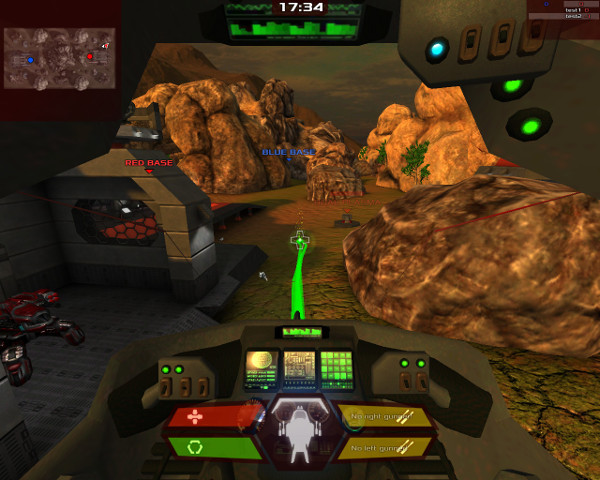

The first player will be the pilot, who can also use the green healing wave to heal other teammates.

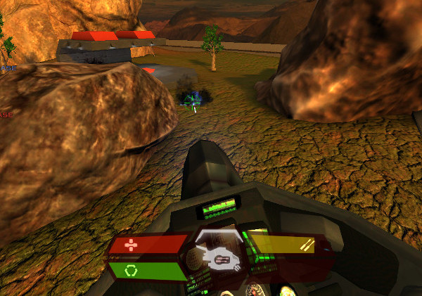

The second player will be the right gunner. The third player will be the left gunner.

When the pilot leaves Bumblebee, the second player becomes the pilot.

There are no secondary weapons for any of the three riders in Bumblebee.

## Racer

The Racer looks like a jet, but does not fly high into the sky, similar to [the racers in Starwar](https://en.wikipedia.org/wiki/Star_Wars_Episode_I:_Racer). Use +jump (default: spacebar) to accelerate it. The acceration consumes power from the same source as the primary weapon.

The Racer takes one player at a time. There are two types of weapon. The primary weapon is laser; the secondary weapon is energy balls that explodes.

## Raptor

The flying Raptor takes one pilot who can also opearate two weapons. There are two different reticles for them. The primary weapon is laser based, and is shot toward the white reticle. The secondary weapon is air-to-groud bombs, is dropped onto the ground the green reticle is pointing at. The white reticle always points at the head of the vehicle. The green reticle is projected by the movement momentum of the vehicle.

## Spiderbot

Spiderbot takes one rider. It walks on the ground and can jump from very high altitude while protecting the rider.

Its primary weapon is machine gun; the aiming direction is shown by the green reticle, which follows the front of the vehicle, given enough time. The secondary weapon is rockets that are aimed with the white reticle, which always points to the front of the vehicle.

# Unofficial vehicles

**This information is old, maybe there are things that are no longer stable.**
On [some servers](Special-Servers), one may find experiment vehicles that are not official, such as tanks, helicopters, jets, etc. Please post your opinions on them in [Xonotic Official Forums](http://forums.xonotic.org).

R22 Helicopter and LL48 Tank were used in the SMB modpack and were removed because these are no longer considered part of the core mod. Perhaps these were removed in October 2018.

## Light APC

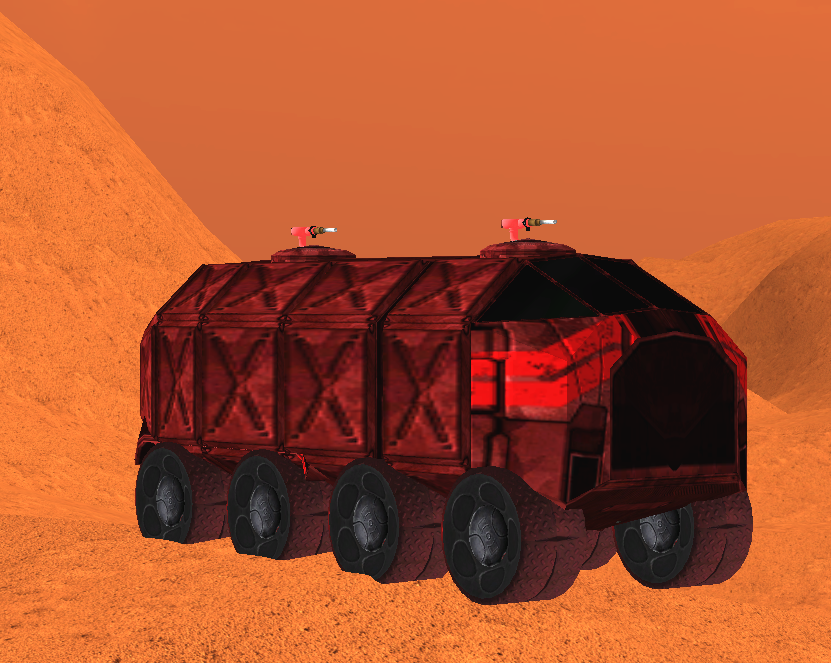

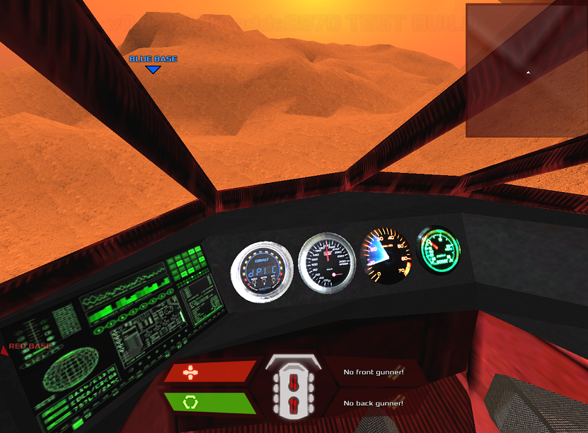

Up to three players can ride the Light APC, a large tank vehicle, at the same time.
The first player will be the pilot, who can drive. It can keep more players inside too.

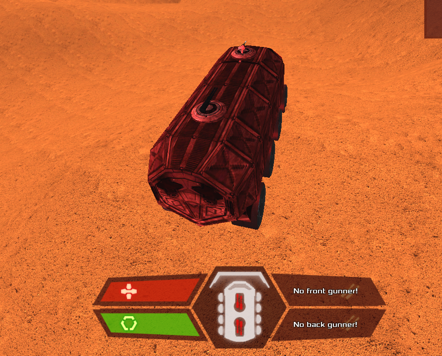

The second player will be the front gunner. The third player will be the back gunner.
When the pilot leaves Light APC, the second player becomes the pilot.
There are no secondary weapons for any of the three riders in Light APC.

## R22 Helicopter

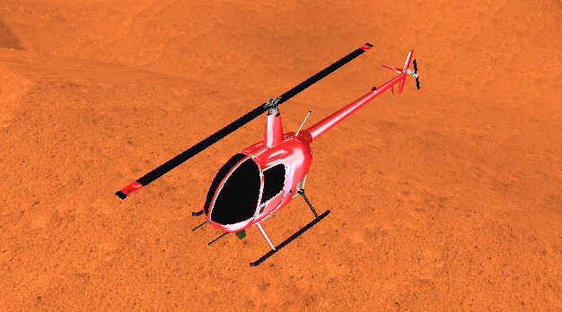

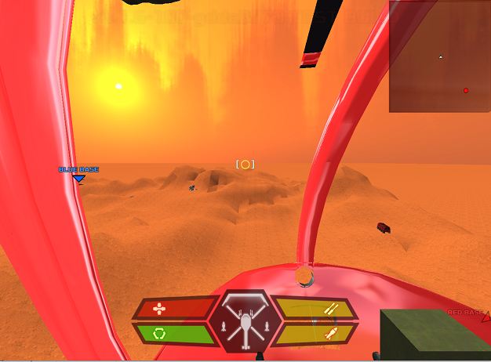

The R22 Helicopter takes one pilot who can also operate two weapons. There are two different reticles for them. Only two players can ride the R22 Helicopter. The second player will be the cockpit, but this player won't do nothing, only will be the spectator of the vehicle inside and he can get out of the vehicle whenever he wants, the same for the pilot. 

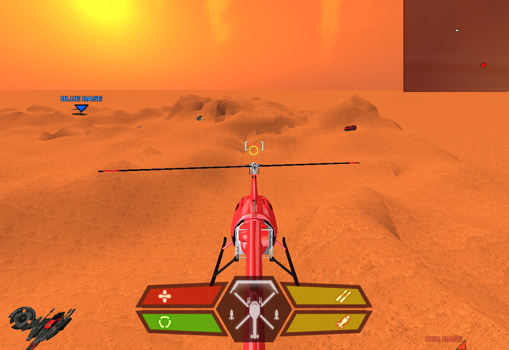

The primary weapon is machine gun and is shot toward the green reticle. The second weapon is remote-controlled missiles that target any nearby object that is around the front, is dropped onto the ground the green reticle is pointing at. The white reticle always points at the head of the vehicle. The green reticle is projected by the movement momentum of the vehicle. The movement controls are the same as [Raptor vehicle](Vehicles#raptor).

## LL48 Tank

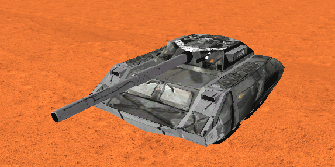

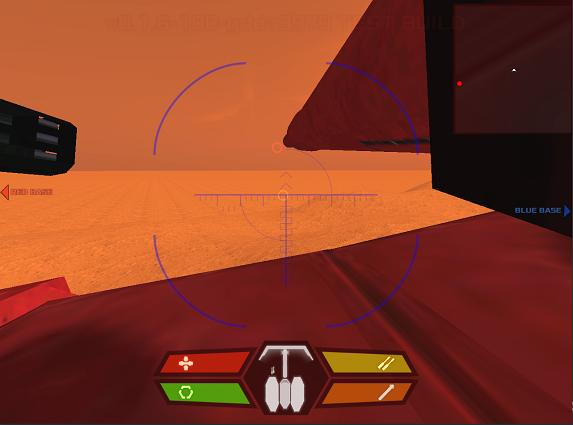

LL48 Tank takes one rider. It walks on the ground and can jump from very high altitude while protecting the rider.

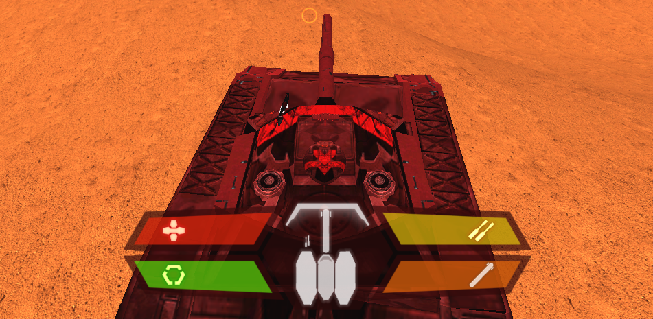

Its primary weapon is the HLAC; the aiming direction is shown by the orange reticle, which follows the front of the vehicle, it does the same as Light APC front gunner. The secondary weapon is the Tank Cannonball that are aimed with the red reticle, which always points to the front of the vehicle, reloading ammo takes a bit of time. Press SHIFT to move the secondary weapon down and press SPACE to move up.

# Notes for mappers

Vehicle class names for mappers:

- Bumblebee: "vehicle_bumblebee"
- Racer: "vehicle_racer"
- Raptor: "vehicle_raptor"
- Spiderbot: "vehicle_spiderbot"

Unofficial vehicle class names:

- Light APC: "vehicle_lightapc"
- R22 Helicopter: "vehicle_r22heli"
- LL48 Tank: "vehicle_tankll48"

# Notes for developers

`Assault` needs testing, as far as i can tell it should work now.

`ons/dom` is UNSUPPORTED, as in targeting vehicles with those ents - this is in development.

Maps needed, `as` and `ctf` for now - i cant take this much further w/o play testing on a larger scale.

**Official vehicles source codes are in this [directory](https://gitlab.com/xonotic/xonotic-data.pk3dir/-/tree/master/qcsrc/common/vehicles/vehicle).**

There are unofficial vehicles source codes stored in the [SMB modpack](https://github.com/MarioSMB/modpack/tree/master/mod/common/vehicles).

Some unofficial vehicles are in the jeff-modpack.

Remember if you had them installed in the game, to activate those unofficial vehicles:

`g_vehicles 1 // activate the vehicles in the game`

`set g_vehicles_extra 1 // activate the unofficial vehicles in the game`

`set g_vehicle_tankll48 1 // activate LL48 Tank vehicle in the game`

`set g_vehicle_r22heli 1 // activate R22 Helicopter in the game`

`set g_vehicle_lightapc 1 // activate Light APC in the game`

`set g_vehicles_enter 0 // activate enter inside vehicle automatically instead pressing the key to enter inside`

`set g_vehicles_vortex_damagerate 2`

`set g_vehicle_r22heli_shield_regen 20 // energy regeneration quantity`

`set g_vehicle_r22heli_shield 600 // energy shield`

`set g_vehicle_r22heli_health_regen 15 // health regeneration quantity`

`set g_vehicle_r22heli_speed_forward 2500 // R22 Helicopter speed when it's moving forward`

`set g_vehicle_tankll48_health 3500 // LL48 Tank health quantity`

`set g_vehicle_tankll48_cannon_damage 2000 // LL48 Tank Cannon damage quantity`

It's recommended testing those vehicles in a map called **mars** and with mapinfo and entity files.